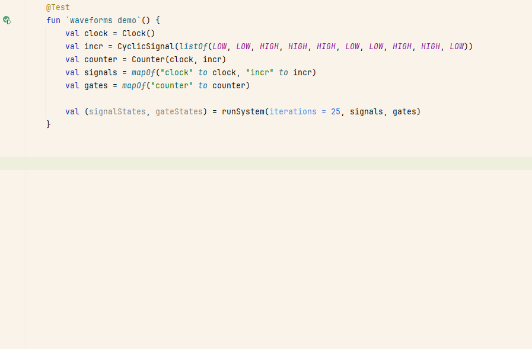

# Expekt tests

Inline snapshot testing for Kotlin and Java, inspired by JaneStreet's [expect-tests framework for OCaml](https://blog.janestreet.com/the-joy-of-expect-tests/)



- [Principles](#principles)
- [External resources on snapshot testing](#external-resources-on-snapshot-testing)
- [Setup](#setup)
  + [Maven](#from-maven)
  + [From Source](#from-source)
- [Usage](#usage)
  + [Kotlin](#kotlin)
  + [Java](#java)

## Principles

Expekt is a lightweight **inline** **snapshot testing** tool:
- it fails when there is a diff between expected outputs and actual ones. With Expekt, the expected outputs are expressed as raw string blocks in source code.
- it offers a 'promotion' mechanism to replace the expected outputs with the actual ones when the user (developer) decides the change is suitable. The promotion is done directly in the source code, altering the string blocks. 

This means that efforts to represent your objects as readable strings, (such as ascii art, tables, graphs ...) can be directly exploited as readable assertions.
It also makes updating these assertions effortless, should their representation change.

## External resources on snapshot testing

Inline snapshot (also called approval, acceptance, golden-master, ...) is a popular technique in many ecosystems.

A few resources on this topic:
- [The JaneStreet article on the expect-test library that inspired Expekt](https://blog.janestreet.com/the-joy-of-expect-tests/)
- [An article describing the advantages of inline snapshot testing](https://ianthehenry.com/posts/my-kind-of-repl/)
- [An article from TigerBeetle describing their Zig library for inline snapshot testing](https://tigerbeetle.com/blog/2024-05-14-snapshot-testing-for-the-masses/)
- [Insta, a Rust library for snapshot testing](https://tigerbeetle.com/blog/2024-05-14-snapshot-testing-for-the-masses/)

## Setup

### From Maven

Add expekt dependency to your `pom.xml`:

```xml
<dependency>
    <groupId>io.github.nyub</groupId>
    <artifactId>expekt-test</artifactId>
    <version>0.1.0</version>
    <scope>test</scope>
</dependency>
```

### From source

The source code is only comprised of 2 files (and even 1 if you don't use the JUnit extension).
Feel free to download [ExpectTests.kt](src/main/kotlin/nyub/expekt/ExpectTests.kt) and [ExpectTestExtension.kt](src/main/kotlin/nyub/expekt/junit/ExpectTestExtension.kt) directly into your sources and experiment.

## Usage

### Kotlin

The recommended usage for Kotlin is to define an ExpectTests shared configuration and write your test with the `expectTest { }` scope function. See [the kotlin tests](src/test/kotlin/nyub/expekt/KotlinUsageTest.kt) for examples.

The JUnit 5 extension is also usable from the Kotlin side, even if it brings fewer improvements than for [Java users](#java).

### Java

The recommended usage for Java is to use the provided JUnit 5 extension. See [the java tests](src/test/kotlin/nyub/expekt/JavaUsageTest.java) for examples

For non-junit codebases, the Kotlin scope functions are usable on the Java side, with slightly degraded ergonomics.

### Constraints ont expected string blocks

Expekt detects string blocks to check and promote based on a few heuristics.

This imposes some formatting rule regarding the "expect" call.

1) the `expect(` call should be written in place, not aliased
2) the expected content should be in a triple-quoted-string block
3) the starting triple-quotes should either be:
    1) immediately after the `expect(` call, at the end of the line
    2) on the line just below the `expect(` call, alone on this line

#### OK:

```kotlin
expect("""
<CONTENT>
""")
```

```kotlin
expect(
"""
<CONTENT>
""")
```

```kotlin
expect(
"""
<CONTENT>
"""
)
```

#### Not OK:

```kotlin
expect("<CONTENT>")
```

- (because the expected content is not within a triple-quoted block)

```kotlin
expect("""<CONTENT>
""")
```

- (because the starting quotes are not at the end of the line)

```kotlin
expect(f("""
<CONTENT>
"""))
```

- (because the starting quotes are not immediately after the `expect(` call)

```kotlin
expect(
f("""
<CONTENT>
"""))
```

- (because the starting quotes are not alone on their line)

```kotlin
fun alias(s: String) = expect(s)
alias(
"""
<CONTENT>
"""
)
```

- (because expect is aliased, so the search starts from the actual call site on the first line)

