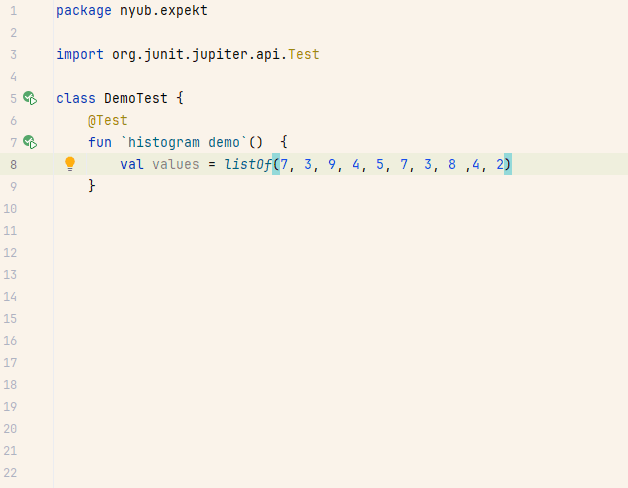

# Expekt tests

Minimal print-based in-source snapshot tests for Kotlin and Java, inspired by JaneStreet's [expect-tests framework for OCaml](https://blog.janestreet.com/the-joy-of-expect-tests/)

## Principles

Expekt is a lightweight acceptance test tool:
- it fails when there is a diff between expected outputs and actual ones. With Expekt, the expected outputs are expressed as raw string blocks in source code.
- it offers a 'promotion' mechanism to replace the expected outputs with the actual ones when the user (developer) decides the change is suitable. With Expekt, the promotion is done 'in source', directly altering the string blocks in the source files. 

This means that efforts to represent your objects as readable strings, (such as ascii art, tables, graphs ...) can be directly exploited as readable assertions.
It also makes updating these assertions effortless, should their representation change.

## Setup

There is currently no deployed artifact, but the source code is only comprised of 2 files (and even 1 if you don't use the JUnit extension).
Feel free to copy-paste and experiment.

## Usage

### Kotlin

The recommended usage for Kotlin is to define an ExpectTests shared configuration and write your test with the `expectTest { }` scope function. See [the kotlin tests](src/test/kotlin/nyub/expekt/KotlinUsageTest.kt) for examples.

The Junit 5 extension is also usable from the Kotlin side, even if it brings fewer improvements than for [Java users](#java).

### Java

The recommended usage for Java is to use the provided JUnit 5 extension. See [the java tests](src/test/kotlin/nyub/expekt/JavaUsageTest.java) for examples

For non-junit codebases, the Kotlin scope functions are usable on the Java side, with slightly degraded ergonomics.
